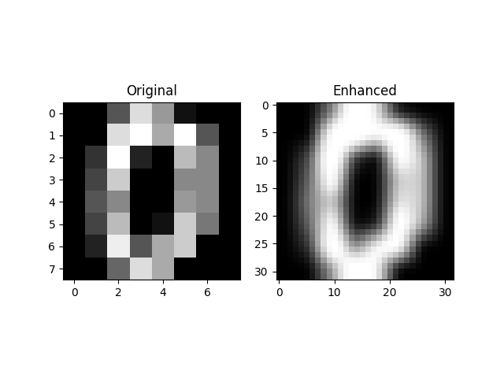

# Image Classification using OpenCV and Machine Learning

##  Project Overview
This project implements a simple image classification system using:

- OpenCV for image preprocessing  
- Support Vector Machine (SVM) for classification  
- Scikit-Learn digits dataset (0–9 handwritten digits)  

The goal of the project is to understand:

- image preprocessing
- brightness and contrast enhancement
- filtering techniques
- training and testing a machine learning model
- evaluating accuracy and confusion matrix

##  Technologies Used
- Python  
- OpenCV  
- Scikit-Learn  
- NumPy  
- Matplotlib  

## Dataset Used
The project uses the **Scikit-Learn Digits Dataset**, which contains:

- 8×8 grayscale handwritten digit images  
- labels from 0 to 9  

## Image Processing Steps
The following preprocessing steps were applied using OpenCV:

- Convert grayscale images  
- Resize images to 32×32  
- Normalize pixel values  
- Adjust brightness and contrast  
- Apply Gaussian blur filter  

Original and enhanced images are displayed side-by-side.

##  Machine Learning Model
The classifier used in this project is:

- ✔ Support Vector Machine (SVM)

##  Train–Test Split
Dataset was split into:

- 80% training data  
- 20% testing data  

## Model Evaluation
The model was evaluated using:

- Accuracy score  
- Confusion matrix  
- Sample prediction visualization  

##  How to Run the Project

### 1️⃣ Install dependencies
pip install -r requirements.txt

### 2️⃣ Run the program
python main.py

##  Output Screenshot

## ✅ Results
The SVM model achieved an accuracy of approximately:

98–99%

## 🏷 Submission Tag
#cl-ai-imageclassification
